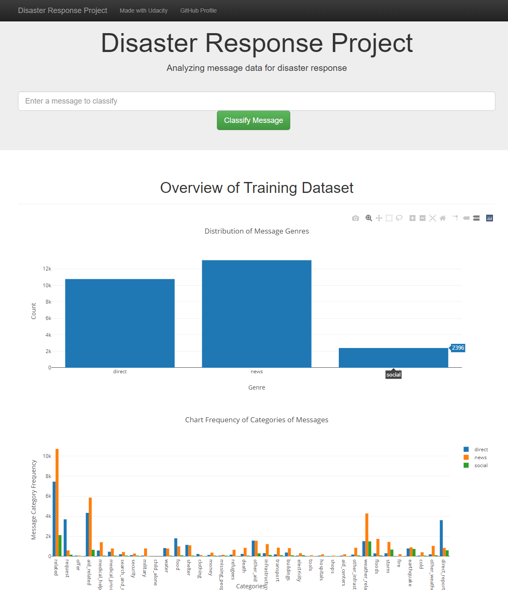
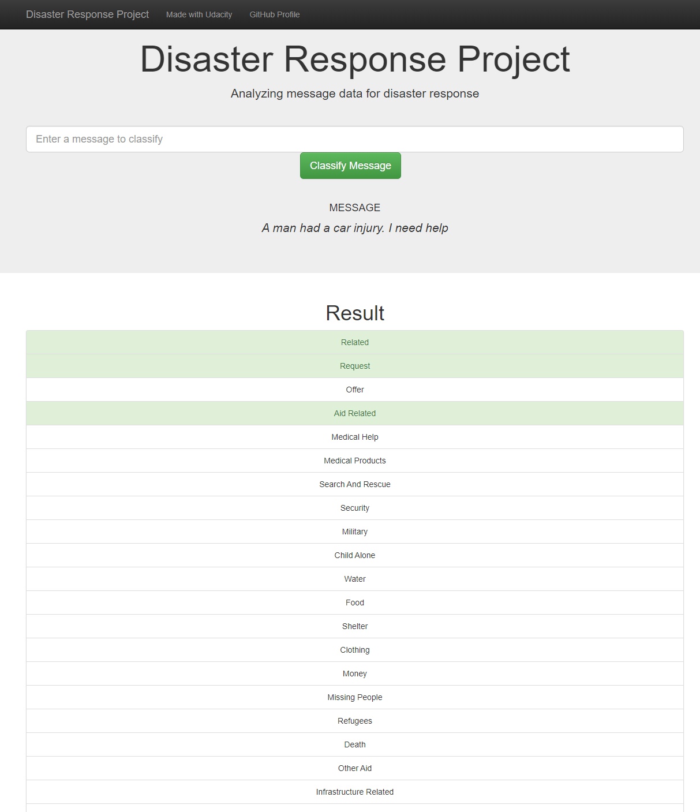

# Disaster Response Pipeline Project
A NLP classification project with a WebApp to classify SMS.
This project is part of the Udacity Data Science Nano Degree.


### Table of Contents

1. [Installation](#installation)
2. [Project Motivation](#motivation)
3. [File Descriptions](#files)
4. [Results](#results)
5. [Licensing, Authors, and Acknowledgements](#licensing)

## Installation <a name="installation"></a>

You need to have a Python 3.x environment. I used anaconda. This project uses some packages, which you might need to install using the statement "pip install my_package" in your conda console.

This project uses public available libraries:
- sikit-learn
- nltk
- numpy
- pandas
- plotly
- sqlalchemy
- flask


## Project Motivation<a name="motivation"></a>

I used a dataset provided by Figure Eight for a Udacity project task. The objective is to clean up the raw data, develop and optimize a full machine learning pipeline for text classification. The classified model should be used in a web app for on-demand text message classification.

Dashboard:


On demand text message classification


## File Descriptions <a name="files"></a>

* app/run.py This file is responsible for starting the flask webapp. It contains the webapp plotly visualizations and iteracts with the data sources.
* data/process_data.py This file represents the ETL pipeline. It cleans the input csv files, outputs a sql database file.
* models/train_classifier.py This file represents the ML pipeline. Using the prepared data in the database file, it trains a classifier, creates model performance statistics and stores the model as pickle-file.

## Instructions <a name="instructions"></a>
```sh
  1. Run the following commands in the project's root directory to set up your database and model.

      - To run ETL pipeline that cleans data and stores in database
          `python data/process_data.py data/disaster_messages.csv data/disaster_categories.csv data/DisasterResponse.db`
      - To run ML pipeline that trains classifier and saves
          `python models/train_classifier.py data/DisasterResponse.db models/classifier.pkl`

  2. Run the following command in the app's directory to run your web app.
      `python run.py`

  3. Go to http://0.0.0.0:3001/
```

## Results<a name="results"></a>
The projects shows the whole data science process. There's no focus on the model performance. I added some features as comment, which might improve the model performance, but takes longer to calculate.


## Licensing, Authors, Acknowledgements<a name="licensing"></a>

As this project is part of Udacity's Data Science Nano Degree, I used provided ressources by them. The data was provided by Figure Eight. All the licensing for the data and other information can be found on [Udacity](https://udacity.com/)
